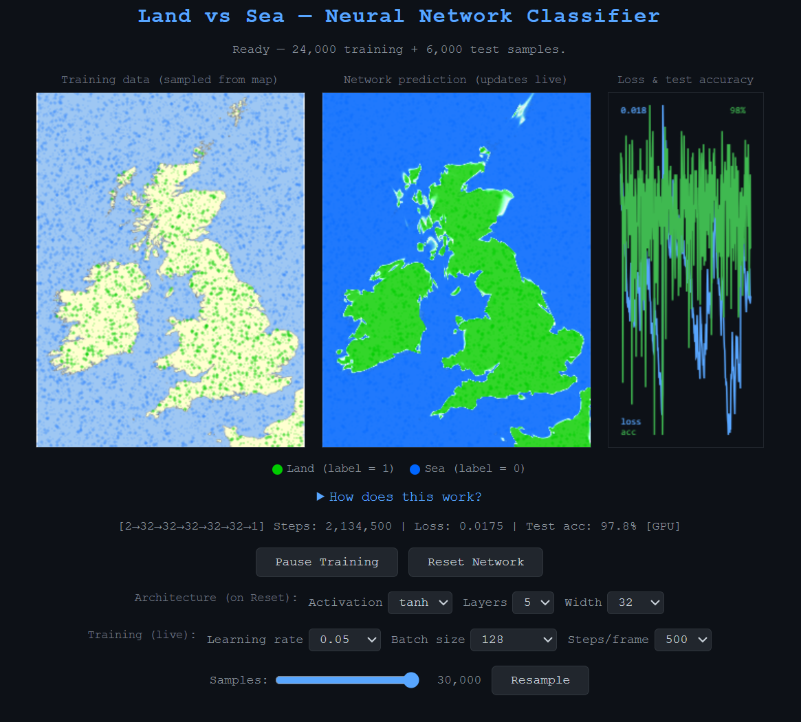

# Land vs Sea — Neural Network Classifier

A browser-based demo that trains a neural network to distinguish land from sea across a map of the British Isles. Random points are sampled from a map image and labelled as "land" or "sea". A configurable multi-layer network then learns to classify every pixel, producing a live prediction heatmap that converges toward the coastlines.

Both training and rendering run on the GPU via WebGL2 fragment shaders when available, with a CPU/Canvas 2D fallback.

## How it works

1. A map of the British Isles is fetched from Wikimedia Commons and sampled at random pixel locations to build a training set of (x, y) coordinates labelled land or sea.
2. A fully-connected neural network (configurable depth, width, and activation function) is trained with mini-batch SGD and binary cross-entropy loss.
3. Every animation frame, the network's prediction is evaluated at every pixel and rendered as a heatmap — blue for land, red for sea, white for uncertain.

## Usage

Open `index.html` in any modern browser. No build step, no dependencies.

## License

[MIT](LICENSE)
